# SnipGenius README

This is the README for your extension "SnipGenius". SnipGenius provides a collection of PHP snippets to simplify common coding tasks. This documentation covers the features, settings, and other relevant details for using this extension.

## Features

SnipGenius includes the following PHP snippets:

- **`Database Connection`**  
   Prefix: `dbconn`  
   Description: Generates a procedural `database connection`.

  ```php
  $servername = "";
  $username = "";
  $password = "";
  $dbname = "";
  $conn = mysqli_connect($servername, $username, $password, $dbname);
  if (!$conn) {
  die("Connection failed: " . mysqli_connect_error());
  }
  ```

- **`SELECT Query`**
  Prefix: `dbread`
  Description: Generates a procedural `SELECT query`.

  ```php
  $sql = "SELECT * FROM tableName WHERE column = 'condition'";
  $result = mysqli_query($conn, $sql);
  if (mysqli_num_rows($result) > 0) {
  while ($row = mysqli_fetch_assoc($result)) {

  }
  } else {
    echo '0 results';
  }
  ```

- **`Insert Query`**
  Prefix: `dbwrite`
  Description: Generates a procedural `INSERT` statement.

  ```php
  $sql = "INSERT INTO tbaleName (keys) VALUES ('')";
  $result = mysqli_query($conn, $sql);

  if ($result) {
    echo 'New record created successfully';
  } else {
    echo 'Error: ' . mysqli_error($conn);
  }
  ```

- **`Update Query`**
  Prefix: `dbupdate`
  Description: Generates a procedural `UPDATE` statement.

  ```php
  $sql = "UPDATE tableName SET column = 'value' WHERE column = 'condition'";
  $result = mysqli_query($conn, $sql);

  if ($result) {
    echo 'Record updated successfully';
  } else {
    echo 'Error: ' . mysqli_error($conn);
  }
  ```

- **`Delete Query`**
  Prefix: `dbdelete`
  Description: Generates a procedural `DELETE` statement.

  ```php
  $sql = "DELETE FROM tableName WHERE column = 'condition'";
  $result = mysqli_query($conn, $sql);

  if ($result) {
    echo 'Record deleted successfully';
  } else {
    echo 'Error: ' . mysqli_error($conn);
  }

  ```

- **`Form Handling`**
  Prefix: `fiq`
  Description: Handles `form data submission` and insertion into the database.

  ```php
  if (isset($_POST['submit'])) { // Here submit is the name of the button that submits the form
    $name = mysqli_real_escape_string($conn, $_POST['name']);
    $email = mysqli_real_escape_string($conn, $_POST['email']);
    $sql = "INSERT INTO users (name, email) VALUES ('$name', '$email')";
    if (mysqli_query($conn, $sql)) {
      echo 'New record created successfully';
    } else {
      echo 'Error: ' . mysqli_error($conn);
    }
  }
  ```

- **`Query Error Check`**
  Prefix: `qch`
  Description: Checks for `errors` after running a MySQL query.

  ```php
  $result = mysqli_query($conn, $sql);
  if (!$result) {
    echo 'Query Error: ' . mysqli_error($conn);
  } else {

  }
  ```

- **`Class Definition`**
  Prefix: `clsdef`
  Description: Generates a basic PHP class definition with `properties, methods, default values`, and usage examples.

  ```php
  class className {
    private $property1 = 'default1';
    private $property2 = 'default2';

    public function __construct($property1 = 'default1', $property2 = 'default2') {
      $this->$property1 = $property1;
      $this->$property2 = $property2;
    }

    public function getProperty1() {
      return $this->$property1;
    }

    public function setProperty1($property1) {
      $this->$property1 = $property1;
    }

    public function getProperty2() {
      return $this->$property2;
    }

    public function setProperty2($property2) {
      $this->$property2 = $property2;
    }
  }

  // Usage Example
  // Create an instance of the class with default values
  $obj = new className();

  // Create an instance with custom values
  $obj = new className('value1', 'value2');

  // Access and modify properties
  $obj->setProperty1('new value1');
  $property1 = $obj->getProperty1();
  $obj->setProperty2('new value2');
  $property2 = $obj->getProperty2();

  ```

- **`Database Connection With custom class`**
  Prefix: `cdbconn`
  Description: Generates a PHP class for `database connection` using OOP with default values and usage examples.

  ```php
  class Database {
    private $servername = 'localhost';
    private $username = 'root';
    private $password = '';
    private $dbname = 'test';
    private $conn;

    public function __construct($servername = 'localhost', $username = 'root', $password = '', $dbname = 'test') {
      $this->$servername = $servername;
      $this->$username = $username;
      $this->$password = $password;
      $this->$dbname = $dbname;
      $this->connect();
    }

    private function connect() {
      $this->$conn = new mysqli($this->$servername, $this->$username, $this->$password, $this->$dbname);
      if ($this->$conn->connect_error) {
        die("Connection failed: " . $this->$conn->connect_error);
      }
    }

    public function getConnection() {
      return $this->$conn;
    }
  }

  // Usage Example
  // Create an instance of the Database class
  $db = new Database();

  // Create an instance with custom values
  $db = new Database('localhost', 'user', 'password', 'database');

  // Access the connection object
  $conn = $db->getConnection();


  ```

- **`Class Based Insert Query Method`**
  Prefix: `fdbwrite`
  Description: Generates an insert query method for the Database class. Use with `insert($table, $columns, $values)`.

  ```php
  public function insert($table, $columns, $values) {
    $sql = "INSERT INTO $table ($columns) VALUES ($values);";
    result = mysqli_query($this->$conn, $sql);
    if (!$result) {
      die("Query Error: " . mysqli_error($this->$conn));
    }
    return $result;
  }

  // Usage Example
  // Create an instance of the Database class
  $db = new Database();

  // Insert data into 'users' table
  $db->insert('users', 'name, email', '"Jon snow", "jon@example.com"');
  ```

- **`Class Based Update Query Method`**
  Prefix: `fdbupdate`
  Description: Generates an update query method for the Database class. Use with `update($table, $set, $conditions)`.

  ```php
  public function update($table, $set, $conditions) {
    $sql = "UPDATE $table SET $set WHERE $conditions;";
    $result = mysqli_query($this->$conn, $sql);
    if (!$result) {
      die("Query Error: " . mysqli_error($this->$conn));
    }
    return $result;
  }

  // Usage Example
  // Create an instance of the Database class
  $db = new Database();

  // Update data in 'users' table
  $db->update('users', 'email = "newemail@example.com"', 'name = "John snow"');
  ```

- **`Class Based Select Query Method`**
  Prefix: `fdbread`
  Description: Generates a select query method for the Database class. Use with `select($table, $columns, $conditions)`.

  ```php
  public function select($table, $columns, $conditions = '') {
    $sql = "SELECT $columns FROM $table WHERE $conditions;";
    $result = mysqli_query($this->$conn, $sql);
    if (!$result) {
      die("Query Error: " . mysqli_error($this->$conn));
    }
    return $result;
  }

  // Usage Example
  // Create an instance of the Database class
  $db = new Database();

  // Select data from 'users' table
  $result = $db->select('users', '*', 'name = "John snow"');
  while ($row = mysqli_fetch_assoc($result)) {
    echo $row['name'] . " - " . $row['email'];
  }
  ```

- **`Class Based Delete Query Method`**
  Prefix: `fdbdelete`
  Description: Generates a delete query method for the Database class. Use with `delete($table, $conditions)`.

  ```php
  public function delete($table, $conditions) {
    $sql = "DELETE FROM $table WHERE $conditions;";
    $result = mysqli_query(this->$conn, $sql);
    if (!$result) {
      die("Query Error: " . mysqli_error($this->$conn));
    }
    return $result;
  }

  // Usage Example
  // Create an instance of the Database class
  $db = new Database();

  // Delete data from 'users' table
  $db->delete('users', 'name = "John snow"');
  ```

- **`OOP Database Connection`**
  Prefix: `odbconn`
  Description: Generates a `database connection`.

  ```php
  $servername = "";
  $username = "";
  $password = "";
  $dbname = "";
  $conn = new mysqli($servername, $username, $password, $dbname);

  if ($conn->connect_error) {
    die("Connection failed: " . $conn->connect_error);
  }
  ```

- **`OOP SELECT Query`**
  Prefix: `odbread`
  Description: Generates an `OOP SELECT query`.

  ```php
  $sql = 'SELECT * FROM tableName';
  $result = $conn->query($sql);

  if ($result->num_rows > 0) {
    while ($row = $result->fetch_assoc()) {
      // Process row
    }
  } else {
    echo '0 results';
  }

  ```

- **`OOP Insert Data`**
  Prefix: `odbwrite`
  Description: Generates an `INSERT` statement.

  ```php
  $sql = "INSERT INTO  (columns) VALUES ('');";
  $result = $conn->query($sql);

  if ($result === TRUE) {
    echo 'New record created successfully';
  } else {
    echo 'Error: ' . $sql . '<br>' . $conn->error;
  }
  ```

- **`OOP Update Data`**
  Prefix: `odbupdate`
  Description: Generates an `OOP UPDATE` statement.

```php
$sql = "UPDATE tableName SET  column= 'value' WHERE  column= 'condition';";
$result = $conn->query($sql);

if ($result === TRUE) {
  echo 'Record updated successfully';
} else {
  echo 'Error: ' . $sql . '<br>' . $conn->error;
}
```

- **`OOP Delete Data`**
  Prefix: `odbdelete`
  Description: Generates an `OOP DELETE` statement.

  ```php
  $sql = "DELETE FROM tableName WHERE  column= 'condition';";
  $result = $conn->query($sql);

  if ($result === TRUE) {
    echo 'Record deleted successfully';
  } else {
    echo 'Error: ' . $sql . '<br>' . $conn->error;
  }
  ```

- **`OOP Prepared Statement`**
  Prefix: `prepstmt`
  Description: Generates an `OOP prepared` statement.

  ```php
  $stmt = $conn->prepare("");
  $stmt->bind_param("", );
  $stmt->execute();

  $result = $stmt->get_result();
  if ($result->num_rows > 0) {
    while ($row = $result->fetch_assoc()) {

    }
  } else {
    echo '0 results';
  }
  $stmt->close();

  ```

- **`PDO Connection`**
  Prefix: `pdoconnect`
  Description: Generates a PDO `database connection`.

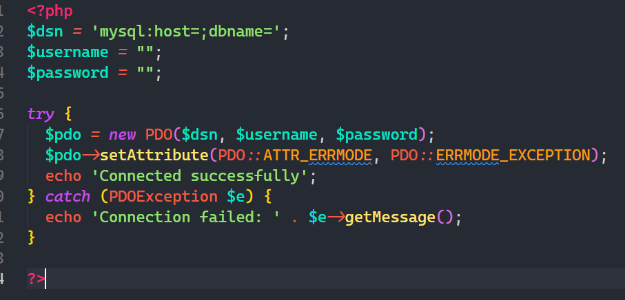

- **`PDO Insert Data`**
  Prefix: `pdoinsert`
  Description: PDO Inserts data into a table.

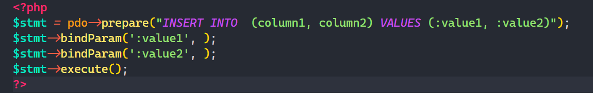

- **`PDO Read Data`**
  Prefix: `pdoread`
  Description: Read data from a table.

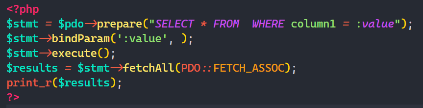

- **`PDO Update Data`**
  Prefix: `pdoupdate`
  Description: Updates data in a table.

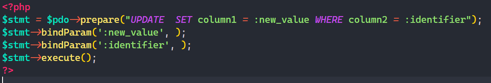

- **`PDO Delete Data`**
  Prefix: `pdodelete`
  Description: Deletes data from a table.

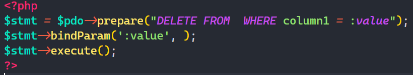

- **`PDO Insert Multiple Rows`**
  Prefix: `pdominsert`
  Description: Inserts multiple rows into a table.

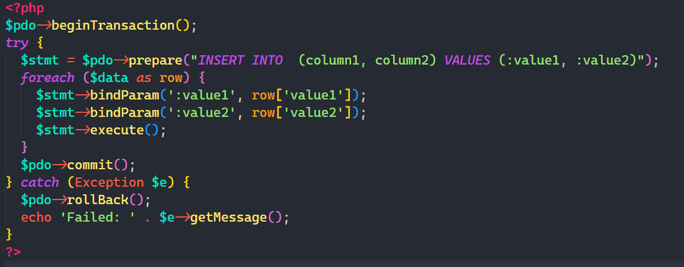

- **`PDO Check Table Exists`**
  Prefix: `ptex`
  Description: Checks if a table exists in the database.

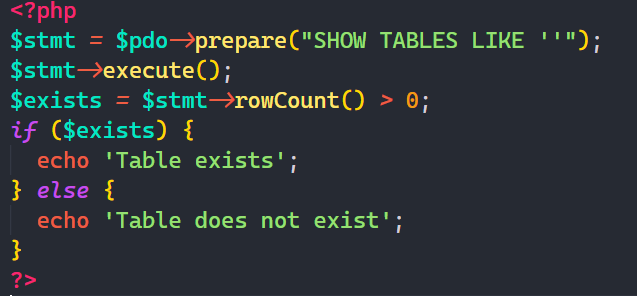

- **`PDO Execute Raw SQL`**
  Prefix: `pexecsql`
  Description: Executes raw SQL query and fetches results.

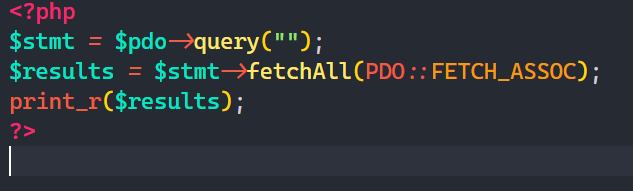

- **`If-Else`**
  Prefix: `ifelse`
  Description: Creates a basic `if-else` statement.


- **`If-elseif-else`**
  Prefix: `ifelseif`
  Description: Creates a basic `If-elseif-else` statement.


- **`Foreach Loop`**
  Prefix: `foreach`
  Description: Creates a `foreach` loop.


- **`Try-Catch Block`**
  Prefix: `trycatch`
  Description: Creates a `try-catch` block.


- **`Include File`**
  Prefix: `inc`
  Description: Includes a PHP file.


- **`Require File`**
  Prefix: `rqr`
  Description: Requires a PHP file.


- **`include_once`**
  Prefix: `inco`
  Description: Generates an `include_once` statement.


- **`require_once`**
  Prefix: `reqo`
  Description: Generates a `require_once` statement.


- **`Database Connection`**
  Prefix: `dbconn`
  Description: Generates a procedural database connection snippet.


- **`SELECT Query`**
  Prefix: `dbread`
  Description: Generates a `SELECT` query snippet.

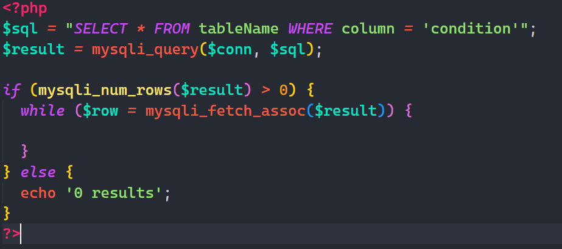

- **`INSERT Query`**
  Prefix: `dbwrite`
  Description: Generates an `INSERT` statement snippet.

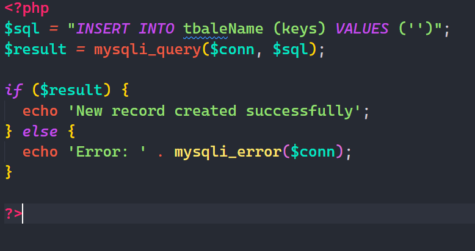

- **`UPDATE Query`**
  Prefix: `dbupdate`
  Description: Generates an `UPDATE` statement snippet.

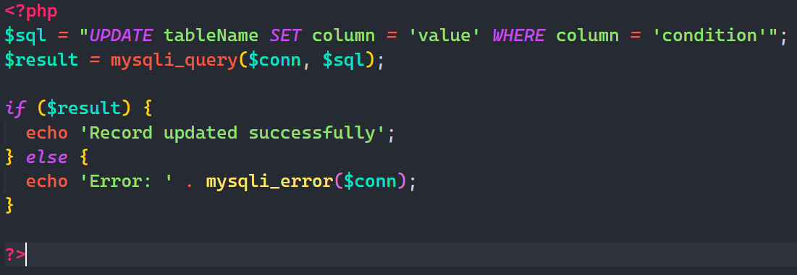

- **`DELETE Query`**
  Prefix: `dbdelete`
  Description: Generates a `DELETE` statement snippet.

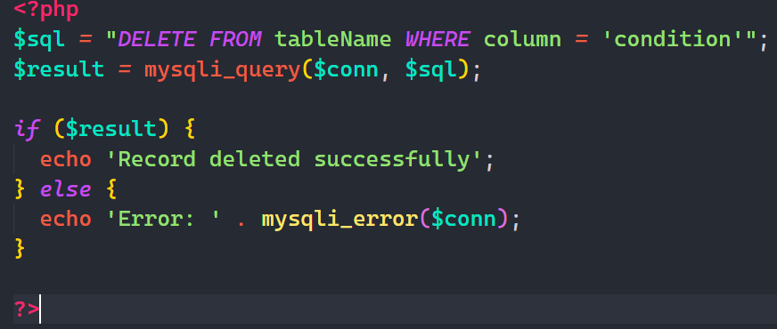

- **`Form Handling`**
  Prefix: `fiq`
  Description: Handles form data submission and insertion into the database.

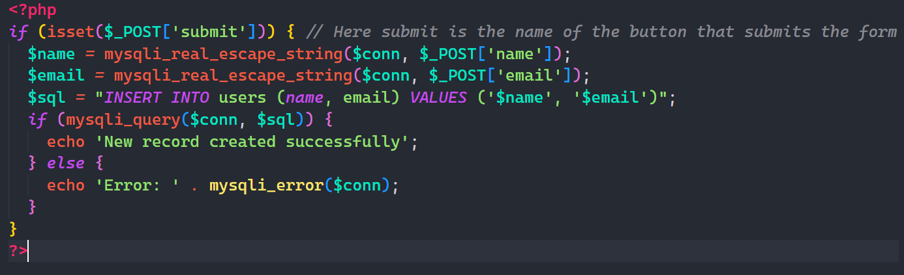

- **`Query Error Check`**
  Prefix: `qch`
  Description: Checks for errors after running a MySQL query.

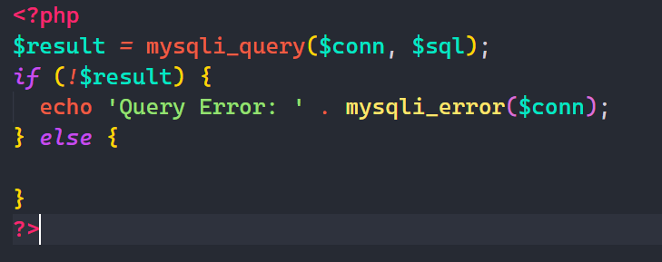

- **`Class Definition`**
  Prefix: `clsdef`
  Description: Generates a basic PHP class definition with properties, methods, default values, and usage examples.

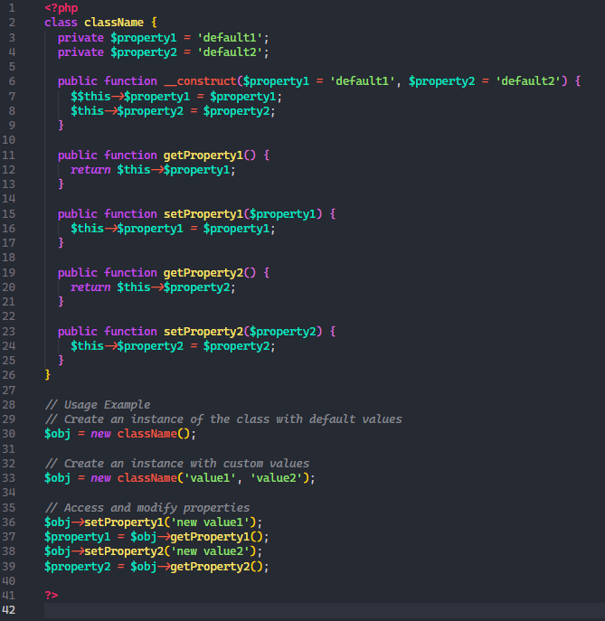

- **`Class Database Connection`**
  Prefix: `cdbconn`
  Description: Generates a PHP class for database connection using OOP with default values and usage examples.

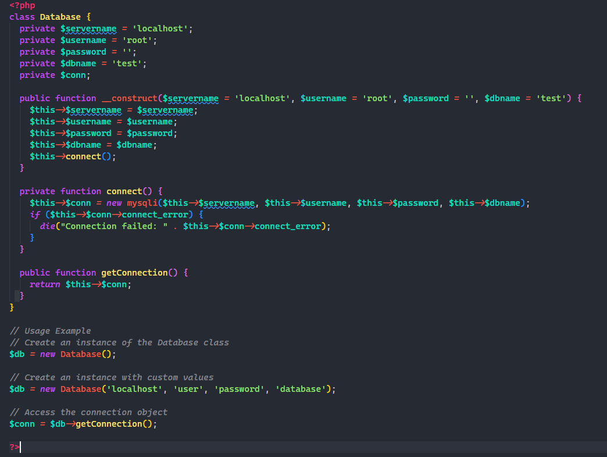

- **`Insert Query Method`**
  Prefix: `fdbwrite`
  Description: Generates an insert query method for the Database class.

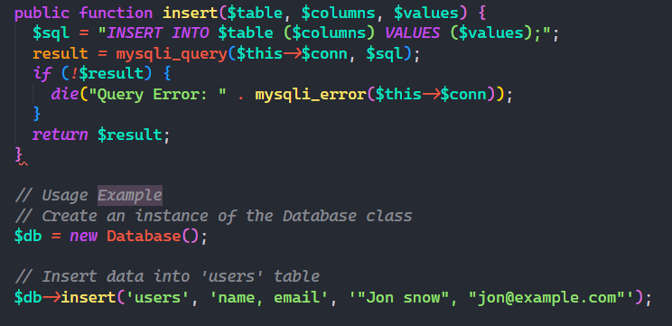

- **`Update Query Method`**
  Prefix: `fdbupdate`
  Description: Generates an update query method for the Database class.

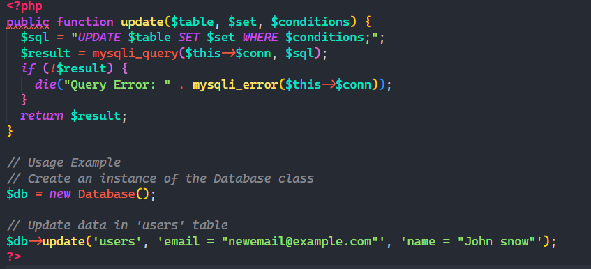

- **`Select Query Method`**
  Prefix: `fdbread`
  Description: Generates a select query method for the Database class.

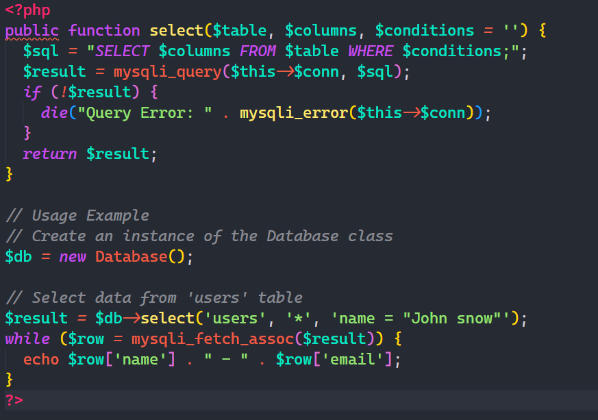

- **`Delete Query Method`**
  Prefix: `fdbdelete`
  Description: Generates a delete query method for the Database class.

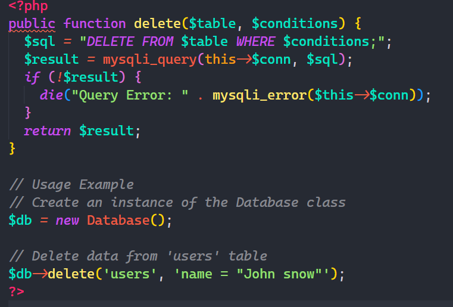

- **`OOP Database Connection`**
  Prefix: `odbconn`
  Description: Generates a database connection snippet.

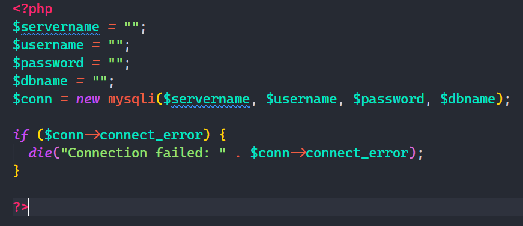

- **`PDO Connection`**
  Prefix: `pdoconnect`
  Description: Generates a PDO database connection snippet.


- **`OOP SELECT Query`**
  Prefix: `odbread`
  Description: Generates an OOP SELECT query snippet.


- **`OOP Insert Data`**
  Prefix: `odbwrite`
  Description: Generates an INSERT statement snippet.


- **`OOP Update Data`**
  Prefix: `odbupdate`
  Description: Generates an OOP UPDATE statement snippet.


- **`OOP Delete Data`**
  Prefix: `odbdelete`
  Description: Generates an OOP DELETE statement snippet.


- **`OOP Prepared Statement`**
  Prefix: `prepstmt`
  Description: Generates an OOP prepared statement snippet.


- **`If-Else`**
  Prefix: `ifelse`
  Description: Creates a basic if-else statement.


- **`If-Else if-else`**
  Prefix: `ifelseif`
  Description: Creates a basic if-else if-else statement.


- **`Foreach Loop`**
  Prefix: `foreach`
  Description: Creates a foreach loop.


- **`Try-Catch Block`**
  Prefix: `trycatch`
  Description: Creates a try-catch block.


- **`Include File`**
  Prefix: `inc`
  Description: Includes a PHP file.


- **`Require File`**
  Prefix: `rqr`
  Description: Requires a PHP file.


- **`Include Once`**
  Prefix: `inco`
  Description: Generates an 'include_once' statement.


- **`Require Once`**
  Prefix: `rqro`
  Description: Generates a 'require_once' statement.


- **`Session Start`**
  Prefix: `sessionstart`
  Description: Starts a PHP session.


- **`HTTP Header`**
  Prefix: `hdr`
  Description: Sends a raw HTTP header.


- **`Set Cookie`**
  Prefix: `setcookie`
  Description: Sets a cookie.


- **`Get Request`**
  Prefix: `get`
  Description: Retrieves data from a GET request.


- **`Post Request`**
  Prefix: `post`
  Description: Retrieves data from a POST request.


- **`Date and Time`**
  Prefix: `date`
  Description: Gets the current date and time.


- **`DateTime Format 1`**
  Prefix: `datetime1`
  Description: Outputs the current date and time in the format dd/mm/yy HH:mm:ss.


- **`Date Format 1`**
  Prefix: `dMy`
  Description: Outputs the current date in the format dd M yyyy.


- **`Time Format 1`**
  Prefix: `timeA`
  Description: Outputs the current time in the format h:i AM/PM.


- **`Day and Month Format`**
  Prefix: `daymonth`
  Description: Outputs the current day and month in the format l F Y.


- **`Print Array`**
  Prefix: `pra`
  Description: Prints an array in a readable format.


- **`Check Variable Set`**
  Prefix: `issetcheck`
  Description: Checks if a variable is set.


- **`File Upload`**
  Prefix: `fileupload`
  Description: Handles file upload.


- **`Generate Random String`**
  Prefix: `randstring`
  Description: Generates a random string of a given length.


- **`Send Email`**
  Prefix: `sendemail`
  Description: Sends an email.


- **`Check File Exists`**
  Prefix: `fileexists`
  Description: Checks if a file exists.


- **`Read File`**
  Prefix: `readfile`
  Description: Reads the content of a file.


- **`Write to File`**
  Prefix: `writefile`
  Description: Writes content to a file.


- **`Sanitize Input`**
  Prefix: `sanitize`
  Description: Sanitizes input data.


- **`Validate Email`**
  Prefix: `validateemail`
  Description: Validates an email address.


- **`Generate UUID`**
  Prefix: `uuid`
  Description: Generates a UUID.


- **`Check Array`**
  Prefix: `isarray`
  Description: Checks if a variable is an array.


- **`Array to JSON`**
  Prefix: `arraytojson`
  Description: Converts an array to JSON format.


- **`JSON to Array`**
  Prefix: `jsontoarray`
  Description: Decodes JSON string to an array.


- **`String Contains`**
  Prefix: `strcontains`
  Description: Checks if a string contains a substring.


- **`Current Timestamp`**
  Prefix: `timestamp`
  Description: Gets the current Unix timestamp.


- **`Date Difference`**
  Prefix: `datediff`
  Description: Calculates the difference between two dates.


- **`Check Empty`**
  Prefix: `isempty`
  Description: Checks if a variable is empty.


- **`Validate URL`**
  Prefix: `vurl`
  Description: Validates a URL.


- **`Format Date`**
  Prefix: `formatdate`
  Description: Formats a date.


- **`Trim Whitespace`**
  Prefix: `trimspace`
  Description: Trims whitespace from a string.


- **`To Uppercase`**
  Prefix: `toupper`
  Description: Converts a string to uppercase.


- **`To Lowercase`**
  Prefix: `tolower`
  Description: Converts a string to lowercase.


- **`Check Writable`**
  Prefix: `iswritable`
  Description: Checks if a file is writable.


- **`File Size`**
  Prefix: `filesize`
  Description: Calculates the size of a file in bytes.


- **`File Extension`**
  Prefix: `fileext`
  Description: Gets the extension of a file.


- **`Count Words`**
  Prefix: `countwords`
  Description: Counts the number of words in a string.


- **`Replace Text`**
  Prefix: `replacetext`
  Description: Replaces text in a string.


- **`Find Text`**
  Prefix: `findtext`
  Description: Finds text in a string.


- **`Extract Substring`**
  Prefix: `substring`
  Description: Extracts a substring from a string.


- **`Random Integer`**
  Prefix: `rint`
  Description: Generates a random integer between min and max values.


- **`String Length`**
  Prefix: `strlen`
  Description: Calculates the length of a string.


- **`File Modification Time`**
  Prefix: `filemtime`
  Description: Gets the last modification time of a file.


- **`Validate Integer`**
  Prefix: `vint`
  Description: Validates if a value is an integer.


- **`For loop`**
  Prefix: `for`
  Description: Creates a for loop.


- **`Constructor method`**
  Prefix: `_c`
  Description: Creates a constructor method.


- **`Error Logging`**
  Prefix: `errorlog`
  Description: Logs errors to the PHP error log file.


- **`Custom Error Handler`**
  Prefix: `errorCustom`
  Description: Sets a custom error handler function.


- **`Shorthand If Statement`**
  Prefix: `?if`
  Description: Shorthand if statement (ternary operator) for concise conditional assignments.


- **`Nested If Statements`**
  Prefix: `iif`
  Description: Creates nested if statements for more complex conditional logic.


- **`Switch Statement`**
  Prefix: `switch`
  Description: Creates a switch statement with multiple cases.


- **`Do-While Loop`**
  Prefix: `dowhile`
  Description: Creates a do-while loop in PHP.


- **`While Loop`**
  Prefix: `while`
  Description: Creates a while loop in PHP.


- **`Array Splice`**
  Prefix: `array_splice`
  Description: Modifies an array by removing or replacing elements.


- **`Multidimensional Arrays`**
  Prefix: `multiarray`
  Description: Defines and accesses elements in a multidimensional array.


- **`Array Functions`**
  Prefix: `arrayfunc`
  Description: Common PHP array functions and their usage.


- **`Multiple Insert PDO`**
  Prefix: `pdoim`
  Description: Performs multiple inserts into a database using PDO.


## Requirements

This extension does not have any specific dependencies. Ensure you have [Visual Studio Code](https://code.visualstudio.com/) installed to use this extension.

## Extension Settings

This extension does not add any custom VS Code settings through the `contributes.configuration` extension point.

## Known Issues

There are no known issues at the moment. If you encounter any problems, please open an issue in the [GitHub repository](https://github.com/your-repo).

## Contributing

Contributions are welcome! Please submit a pull request or open an issue in the [GitHub repository](https://github.com/your-repo).

## License

This extension is licensed under the MIT License. See the [LICENSE](LICENSE) file for details.

---

Enjoy using SnipGenius for your PHP development needs!

```

```

```

```
